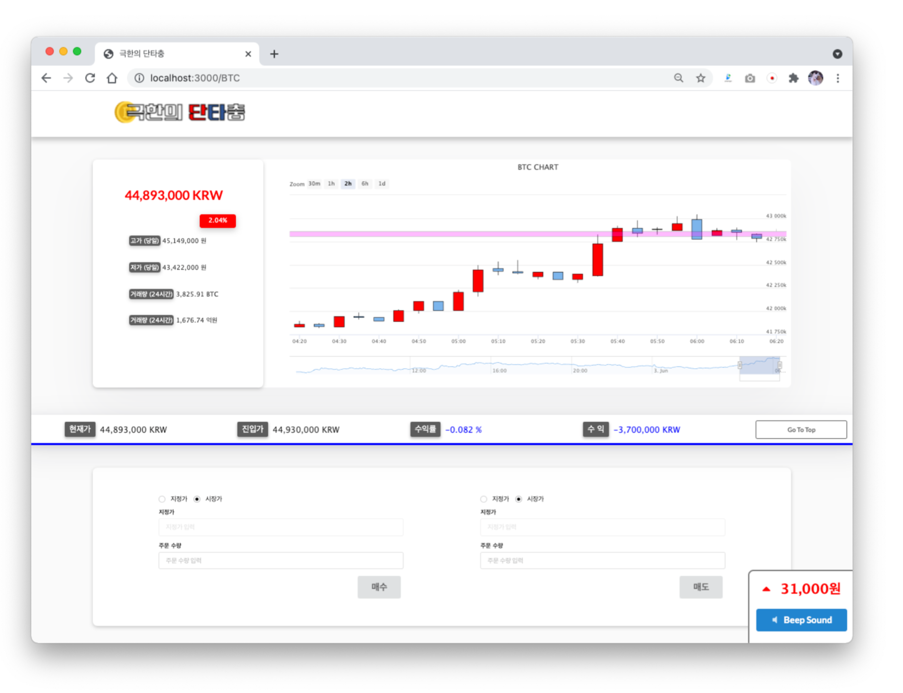

# 극한의 단타충

### Extreme daytrader
  

Service for user who addicted for day trading.  
provide real-time price fluctuation and flow for variety of Cryptocurrency.

  


프로젝트 **극한의 단타충**은 코인 시장에서 (초)단타매매를 즐겨하는 사용자들을 위한 코인 거래소의 오픈 API를 이용하여 정보를 제공하는 서비스를 갖춘 웹사이트이다. 

코인의 실시간 가격 변동과 거래량, 그리고 차트 데이터를 그래프로 볼 수 있는 서비스 를 제공한다.  
실시간 정보를 토대로 코인을 매수 할 수 있으며 그에 따른 수익률을 텍스 트로 표시하고 파악하기 쉽게 색상으로 구분해준다.  
특별한 기능으로 반복적인 신호음을 소리로 출력하며 피치의 높낮이의 따라 상황을 판단할 수 있다. 따라서 못 본 사이 가격 이 급락 또는 급등하는 사태를 예방한다.

가격 정보 외에도 다른 코인의 가격이나, 종목과 관련된 뉴스들을 제공하여 사용자가 관련정보를 편리하게 파악할 수 있다.

<br/>

### Installation Process

* **Node.JS 14.16.1 LTS** is required
```bash
# Repository Clone
git clone https://github.com/Kick-snare/Extreme-DayTrader.git

# Install packages
cd Extreme-Daytrader

git checkout project

// project branch입니다!!

npm install

# Express Local Server Start
npm test

# http://localhost:3000
```


### Technique Used

|Node.js|Express.js|HTML5|CSS3|Javascript|
|:---:|:---:|:---:|:---:|:---:|
||||||


